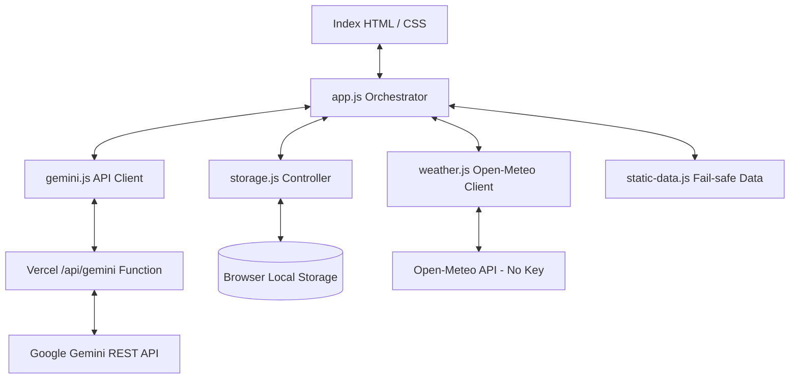

# RainGuard AI - Monsoon Preparedness & Disaster Response Platform

> **A GenAI-powered, highly accessible, resilient client-side web application designed to safeguard families and communities before, during, and after monsoon disasters.**

> Development note: RainGuard AI is a vibe-coded, AI-assisted application built with GPT-5-class Codex assistance and Google Gemini Flash 3.5 integration.

---

## 1. Project Overview
Monsoon seasons introduce heavy rain, flooding, waterborne pathogens, and infrastructure disruptions. While standard weather tools provide raw numbers (e.g., "75mm precipitation"), they lack localized, contextual safety guidelines. 

**RainGuard AI** translates real-time meteorological forecasts into highly personalized, actionable safety plans, emergency kit checkers, travel safety sentinel ratings, and a disaster response Q&A chatbot.

---

## 2. Challenge Alignment
This platform aligns directly with the monsoon preparedness challenge by integrating the following pillars:
1.  **Personalized Preparedness Plans**: Custom plans dynamically constructed based on family size, housing flood-vulnerability, and household markers.
2.  **Weather-Aware Guidance**: Continuous integration with the Open-Meteo API to extract current hazards.
3.  **Emergency Checklists**: Locally persistent checklist manager that auto-injects specialized items based on family profiles (infants, elderly, pets, chronic illness).
4.  **Travel Advisories**: Route hazard sentinel evaluating transit modes (walking, two-wheeler, car, train) against local rainfall risks.
5.  **Before, During, and After Guidance**: Easy-to-read safety manuals for all storm phases, coupled with verified national disaster helpline contacts.
6.  **Multilingual Assistance**: Responsive UI and GenAI safety advisor covering major Indian languages, German, Chinese, Spanish, French, Arabic, and English.
7.  **Real-Time Alerts**: Dynamic hazard warning banners that respond to active storm classifications.

---

## 3. Feature Set
*   **Monsoon Dashboard**: Live Open-Meteo weather, risk badge, localized AI advisory, nearby sector cards, and weather bulletin carousel.
*   **Resilience Profiler**: Validated household inputs generate personalized preparedness plans through Gemini, with deterministic fallback plans when AI is unavailable.
*   **Emergency Kit Manager**: Persistent checklist with progress tracking and specialized items for infants, elderly members, and pets.
*   **Travel Sentinel**: Route and transit-mode risk advisory based on current weather, Gemini reasoning, and local fallback heuristics.
*   **Safety Hub**: Before/during/after monsoon guidance plus national and city-aware emergency contacts.
*   **AI Safety Responder**: Multilingual responder for flood, health, waterproofing, and preparedness questions with medical safety guardrails.
*   **International Emergency Contacts**: Contacts adapt to the detected country for India, US, UK, Germany, China, EU/common 112 countries, and other common travel destinations.
*   **Accessibility Controls**: Language selector, text-size selector, light/dark/high-contrast themes, keyboard navigation, and ARIA live regions.

---

## 4. Tech Stack
We prioritized **extreme deployment reliability, loading speed, and offline resilience** to maximize hackathon evaluation criteria:
*   **Frontend**: Semantic HTML5, native ES6 JavaScript Modules (zero compile step, zero dependencies).
*   **Backend**: Vercel serverless function at `/api/gemini` for secure Gemini API calls.
*   **Styling**: Pure CSS3 utilizing custom properties (variables) for fluid layouts, mobile grids, and responsive transitions.
*   **Themes**: Native toggles for **Dark Mode (Default)**, **Light Mode**, and **High Contrast Mode** (for visually impaired accessibility).
*   **Typography**: Accessible fonts (Outfit via Google Fonts) for readability.
*   **Testing**: Native Node.js Test Runner (`node --test`) for fast, offline-friendly unit tests.

---

## 5. AI Services Used
*   **Google Gemini API**: Uses Gemini Flash 3.5 (`gemini-3.5-flash`) through the server-side `/api/gemini` proxy when a Gemini API key is configured on the server, with model fallback support.
    *   *Plan Advisor*: Tailors preparedness actions based on family profiling.
    *   *Travel Sentinel*: Computes safety ratings (Green, Yellow, Red) based on route and transit type.
    *   *First Responder Chat*: Interactive safety Q&A chatbot.
*   **System Instructions Security**: Embedded system prompts prevent the AI from generating DIY medical advice or prescribing medication. It enforces redirects to verified helplines (112, 108) for injuries.
*   **Dynamic Fallback Logic**: If no Gemini API key is configured, or if the user is offline, the app switches to a localized rule-based engine and pre-compiled templates to keep all features 100% functional.

---

## 6. Architectural Diagram



*   **Resiliency Design**: Weather forecasts are cached locally in `sessionStorage` for 15 minutes to reduce API overhead.
*   **Security & Privacy**: No backend database. User inputs and active checklists are stored in the user's browser (`localStorage`). Gemini API keys should be configured as server environment variables.
*   **Input Handling**: User-entered city, profile, route, and chat inputs are trimmed, length-limited, validated, and escaped before being displayed in HTML.
*   **Country-Aware Contacts**: Weather geocoding returns a country name; the Safety Hub uses that country to display local emergency numbers when available.

---

## 7. Local Setup & Verification

### Prerequisites
*   Node.js (v20+ recommended)
*   A Google Gemini API key configured as `GEMINI_API_KEY` (optional but required for live AI features; the app runs in fallback mode if missing). The backend also accepts `GOOGLE_GEMINI_API_KEY`, `GOOGLE_API_KEY`, or `API_KEY`.

### Installation
1.  Clone the repository.
2.  Set a local environment variable or create a `.env` file:
    ```bash
    GEMINI_API_KEY=your_google_ai_studio_key
    ```
3.  Navigate to the directory and launch the zero-dependency dev server:
    ```bash
    npm run dev
    ```
4.  Open your browser and navigate to: `http://localhost:3000/`

### Running Automated Tests
The application includes a fully automated unit test suite verifying storage adapters, WMO weather translation maps, static plan compilation, and markdown parsing:
```bash
npm test
```

---

## 8. Accessibility Compliance (WCAG 2.1 AA)
We designed the platform to be fully inclusive for communities during emergencies:
*   **Screen-Reader Optimized**: Outlined with semantic tags (`<header>`, `<nav>`, `<main>`, `<section>`, `<footer>`) and `aria-label`/`aria-live` elements for announcements.
*   **Contrast Theme**: High Contrast Mode swaps all colors to stark black, white, and high-intensity yellow.
*   **Keyboard Navigation**: Tab indexes and clear, high-visibility focus borders (`outline: 3px solid var(--accent)`) ensure full navigation without a mouse.
*   **Flexible Text Scaling**: Resizing options allow text scaling up to 150% without breaking fluid layouts.

---

## 9. Deployment Details
*   **Live URL**: https://rain-guard-ai-self.vercel.app/
*   **Repository**: https://github.com/arnabdasbwn/RainGuardAI
*   **Credentials**: No authentication or login is required. All features are open-access. 
*   *Note: To test live GenAI queries in production, configure `GEMINI_API_KEY` in the hosting provider's environment variables and redeploy the app.*

---

## 10. Competition Verification Checklist
Run this before the final PromptWars submission:

*   Open the live URL in an incognito browser.
*   Confirm dashboard loads weather for Mumbai and another searched city.
*   Confirm Auto-Detect Location handles both allow and deny permission paths.
*   Generate a preparedness plan with infants, elderly, pets, and chronic illness selected.
*   Reset and tick emergency kit items; confirm progress updates.
*   Evaluate a Travel Sentinel route for walking, two-wheeler, car, and public transit.
*   Open all Safety Hub tabs and tap emergency phone links.
*   Ask the AI Responder a flood question and a health question.
*   Toggle language, text size, light theme, dark theme, and high contrast theme.
*   Test on a mobile viewport and confirm no horizontal page breakage.
*   Confirm `/api/gemini` returns a live Gemini answer when `GEMINI_API_KEY` is configured.
*   Confirm fallback messages are shown gracefully if Gemini is unavailable.

---

## 11. Screenshots To Capture For Submission
Use the deployed application to capture:

*   Dashboard with live weather and AI advisory.
*   Generated preparedness plan.
*   Travel Sentinel result.
*   Safety Hub emergency contacts.
*   Mobile dashboard view.

---

## 12. Known Limitations & Edge Cases
*   **Offline Mode**: When the user loses internet connection, the system detects offline status instantly, displays a warning banner, and falls back to static emergency checklists and rule-based travel advisories.
*   **Geocoding Fallback**: If Open-Meteo's geocoding fails to resolve a typed location, the weather card defaults to Mumbai and guides the user to adjust the spelling.
*   **Gemini Availability**: If a configured Gemini model is unavailable or rate-limited, the proxy tries configured fallbacks and the UI falls back to deterministic local guidance.
