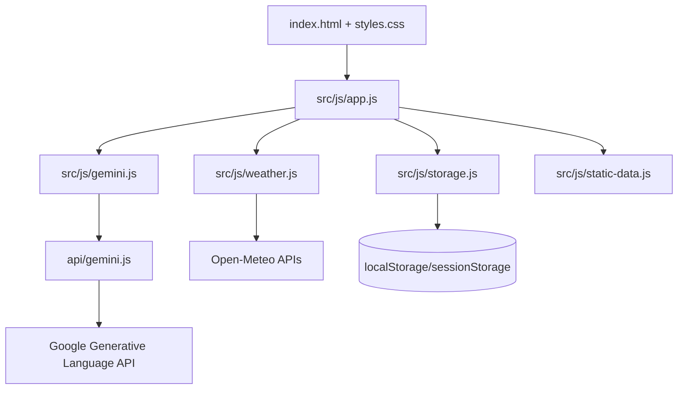

# RainGuard AI

> GenAI-powered monsoon preparedness, weather-aware travel safety, and emergency response guidance for families and communities.

Development note: RainGuard AI is a vibe-coded, AI-assisted competition app built with GPT-5.5-class coding support and a Gemini Flash 3.5 integration path through a secure server proxy.

## Submission Summary

RainGuard AI turns raw weather data into safety actions:

- Live weather risk dashboard using Open-Meteo.
- Personalized household preparedness plans.
- Emergency kit checklist with local persistence.
- Travel Sentinel for route and transit-mode risk.
- Safety Hub with before/during/after guidance and country-aware emergency contacts.
- AI Safety Responder with deterministic offline fallback.
- Accessible language, text-size, dark, light, and high-contrast controls.

The app is intentionally lightweight: semantic HTML, native ES modules, pure CSS, no build step, and no runtime package dependencies.

## Supported Languages

The visible selector is limited to languages with direct UI handling:

- English
- Hindi
- Bengali
- Telugu
- Tamil
- Marathi
- Spanish
- French
- German
- Simplified Chinese
- Arabic

Other fallback-only language aliases were removed from the UI to avoid partial or inconsistent translations during judging.

## Security Posture

RainGuard AI uses a server-side `/api/gemini` proxy so Gemini keys never live in browser JavaScript or `localStorage`.

Implemented protections:

- Same-origin enforcement on `/api/gemini`.
- Per-IP in-memory rate limiting.
- JSON content-type enforcement.
- Request body size limit.
- Prompt/system text length limits.
- Generation config clamping.
- Server-owned safety instruction appended before Gemini calls.
- Escaped Markdown rendering for AI output.
- Safe DOM rendering for guideline content.
- CSP, `nosniff`, referrer policy, frame protection, and permissions policy headers.
- `.env` files ignored by Git.

No authentication is required and no backend database is used. User profiles, checklist state, and theme preference stay in the user's browser.

## AI and Fallback Behavior

Live AI features call:

```text
Browser -> /api/gemini -> Google Generative Language API
```

If the API key is missing, the network is offline, Gemini is unavailable, or the proxy rejects the request, the app falls back to local deterministic guidance:

- Preparedness plan compiler.
- Travel risk heuristics.
- Keyword-based emergency responder.
- Static safety guidelines and contacts.

This keeps the core experience usable during network or API failures.

## Architecture



## Local Setup

Prerequisites:

- Node.js 20+ recommended.
- Optional Gemini key for live AI output.

Create `.env` for local live-AI testing:

```bash
GEMINI_API_KEY=your_google_ai_studio_key
```

Run locally:

```bash
npm run dev
```

Open:

```text
http://localhost:3000/
```

Run tests:

```bash
npm test
```

Useful pre-submission checks:

```bash
node --check api/gemini.js
node --check server.js
node --check src/js/app.js
node --check src/js/gemini.js
node --check src/js/storage.js
node -e "JSON.parse(require('fs').readFileSync('vercel.json','utf8')); console.log('vercel.json ok')"
git diff --check
```

Dependency audit note: this project currently has no package dependencies and no lockfile. `npm audit` requires a lockfile, so dependency risk is minimized by the zero-dependency architecture rather than audited through npm.

## Deployment

- Live URL: https://rain-guard-ai-self.vercel.app/
- Repository: https://github.com/arnabdasbwn/RainGuardAI
- Vercel route: `/api/gemini`

Production live-AI setup:

1. Add `GEMINI_API_KEY` in Vercel project environment variables.
2. Redeploy the app.
3. Confirm `/api/gemini` returns live text for valid same-origin JSON requests.

Compatible environment aliases are supported for hosting flexibility: `GOOGLE_GEMINI_API_KEY`, `GOOGLE_API_KEY`, and `API_KEY`.

## Competition Verification Checklist

- Dashboard loads Mumbai weather and another searched city.
- Auto-detect location handles allow and deny flows.
- Preparedness plan works with infants, elderly, pets, and chronic illness selected.
- Checklist reset and progress updates work.
- Travel Sentinel works for walking, two-wheeler, car, and public transit.
- Safety Hub tabs render and emergency `tel:` links work.
- International contacts change when the detected weather country changes.
- AI Responder handles flood and health questions.
- Gemini fallback messages are graceful when the key is absent.
- Language selector updates visible UI immediately.
- Text-size and theme selectors work.
- Mobile viewport has no horizontal overflow.

## Known Limitations

- In-memory rate limiting is suitable for this lightweight submission but should move to a shared store such as Upstash or Vercel KV for high-volume multi-instance production.
- Offline mode cannot fetch new weather data, but cached/static safety flows remain usable.
- Live AI quality depends on the configured Gemini model availability and quota.
