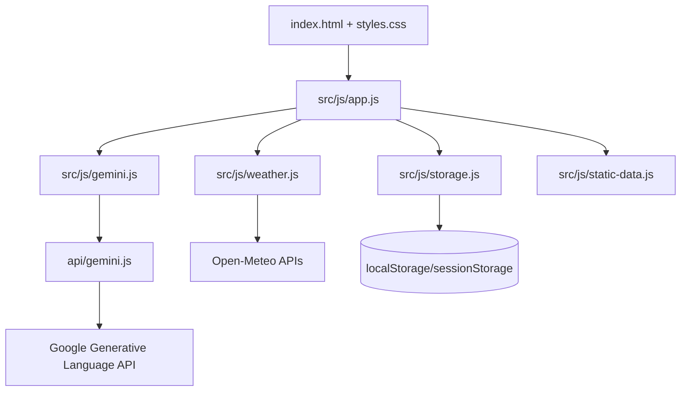

# Architecture Design

RainGuard AI is a static-first disaster preparedness app with a small secure AI proxy. The design goal is reliability under contest judging and real emergency conditions: fast load, no build step, no package dependency chain, graceful fallback, and clear security boundaries.

## 1. Runtime Shape

## 2. Module Responsibilities

- `index.html`: Semantic single-page shell, navigation, forms, and accessible controls.
- `src/css/styles.css`: Responsive styling, text scaling, dark/light/high-contrast themes.
- `src/js/app.js`: Main orchestrator for views, forms, weather rendering, checklists, Safety Hub, and chat.
- `src/js/weather.js`: Open-Meteo geocoding/weather integration with session caching and WMO code labels.
- `src/js/gemini.js`: Client wrapper that formats safety prompts and calls only the server proxy.
- `src/js/storage.js`: Browser persistence for profile, checklist, and theme state. It does not store provider API keys.
- `src/js/static-data.js`: Offline checklists, guidelines, translations, fallback planning logic, and emergency contacts.
- `api/gemini.js`: Vercel serverless Gemini proxy with validation, rate limiting, same-origin checks, and safe error handling.
- `server.js`: Local static server and local `/api/gemini` implementation mirroring production behavior.

## 3. Resiliency Model

Every AI-assisted workflow has a deterministic fallback:

- Preparedness plan: local compiler computes water quantities and injects household-specific guidance.
- Travel Sentinel: local risk heuristic uses weather code, precipitation, wind, and transit mode.
- Chat responder: keyword-based emergency guidance for health, flood, evacuation, and waterproofing topics.
- Safety Hub: static before/during/after guidance and emergency contacts are always available.

Weather data is cached in `sessionStorage` for short-term reuse. User profile/checklist state is kept in `localStorage`; there is no backend database.

## 4. Security Design

The browser never receives a Gemini key. Live AI requests go through `/api/gemini`.

Proxy controls:

- `POST` only.
- Same-origin request enforcement.
- `application/json` enforcement.
- Body size limit.
- Prompt/system text normalization and length caps.
- Temperature and output-token clamping.
- Per-IP in-memory rate limiting.
- Server-owned safety instruction appended before Gemini calls.
- Sanitized error messages that avoid leaking environment names or upstream internals.

Frontend controls:

- User inputs are trimmed, length-limited, and angle-bracket rejected where they can be reflected.
- AI Markdown is escaped before formatting.
- Guideline bold formatting is rendered with text nodes, not raw HTML insertion.
- Security headers are configured in `vercel.json` and mirrored in local dev.

## 5. Submission Quality Notes

- Zero package dependencies reduce supply-chain risk and simplify judging.
- Native Node tests cover storage persistence, weather metadata, translation regressions, fallback plan compilation, and Markdown escaping.
- The visible language selector only includes languages with direct UI handling to avoid partial translation scoring penalties.
