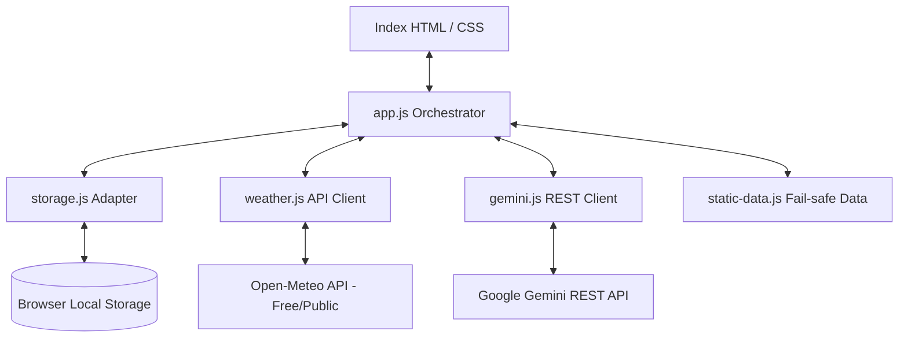

# Architecture Design Documentation

This document describes the structure, state management, and resiliency patterns utilized in the **RainGuard AI** monsoon preparedness platform.

## 1. Zero-Dependency Client-Side Design
To maximize reliability under disaster scenarios (e.g. power grid and network connectivity issues), the application is designed to run entirely in the user's browser as a **single-page static site**.
*   No database backends or remote application servers are required.
*   Zero server-side dependencies.
*   Zero compilation or build step (native ES6 JS modules).

## 2. Component Layout

*   **app.js**: Initializes views, binds navigation, event listeners, updates the weather dashboard, populates carousels, and delegates AI tasks.
*   **storage.js**: Manages user profiles, saved emergency checklist states, theme preferences, and API configuration using the browser's persistent `localStorage`.
*   **weather.js**: Connects to the public Open-Meteo API to retrieve geocoding (coordinates) and real-time weather parameters. Employs a 15-minute `sessionStorage` caching mechanism to avoid API rate limitations and unnecessary network overhead.
*   **gemini.js**: Formats instructions, prompts, and handles direct client-side HTTPS REST requests to the Google AI Studio Gemini API models.
*   **static-data.js**: Houses emergency contacts, static checklists, pre-compiled safety plans, translations, and guidelines for offline/fallback mode.

## 3. Resiliency Fallback System
If the user is offline, does not enter an API key, or if the Gemini API rate limit is exceeded, the orchestrator redirects all AI features (Plan Builder, Travel Sentinel, Chatbot) to the local rule-based engine:
*   **Personalized Plan Builder**: Uses pre-compiled templates, calculating family water/ration needs and injecting housing rules dynamically based on profile metrics.
*   **Travel Sentinel**: Uses local precipitation, wind, and status alerts to run safety checks and returns offline instructions for walking, two-wheelers, cars, and trains.
*   **Safety chatbot**: Employs an offline keyword-matching search indexing health, flooding, and waterproofing rules.
