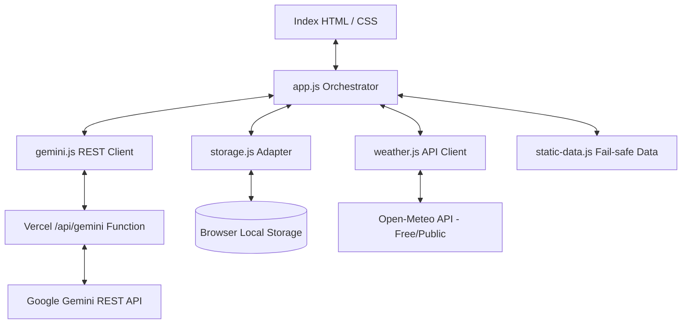

# Architecture Design Documentation

This document describes the structure, state management, and resiliency patterns utilized in the **RainGuard AI** monsoon preparedness platform.

## 1. Static Frontend + Secure AI Proxy
To maximize reliability under disaster scenarios (e.g. power grid and network connectivity issues), the application keeps the core experience as a **single-page static site** while using a small serverless proxy for secure Gemini calls.
*   No database backend is required.
*   The Vercel `/api/gemini` function keeps Gemini API keys out of browser JavaScript.
*   Zero compilation or build step (native ES6 JS modules).

## 2. Component Layout

*   **app.js**: Initializes views, binds navigation, event listeners, updates the weather dashboard, populates carousels, and delegates AI tasks.
*   **storage.js**: Manages user profiles, saved emergency checklist states, and theme preferences using the browser's persistent `localStorage`.
*   **weather.js**: Connects to the public Open-Meteo API to retrieve geocoding (coordinates) and real-time weather parameters. Employs a 15-minute `sessionStorage` caching mechanism to avoid API rate limitations and unnecessary network overhead.
*   **gemini.js**: Formats instructions and prompts, calls the `/api/gemini` proxy first, and falls back to deterministic local logic if live AI is unavailable.
*   **api/gemini.js**: Serverless Gemini proxy. Reads `GEMINI_API_KEY` or compatible aliases from server environment variables, calls Google's REST Interactions API, and supports model fallback.
*   **static-data.js**: Houses emergency contacts, static checklists, pre-compiled safety plans, translations, and guidelines for offline/fallback mode.

## 3. Resiliency Fallback System
If the user is offline, the server key is not configured, or the Gemini API request fails, the orchestrator redirects all AI features (Plan Builder, Travel Sentinel, Chatbot) to the local rule-based engine:
*   **Personalized Plan Builder**: Uses pre-compiled templates, calculating family water/ration needs and injecting housing rules dynamically based on profile metrics.
*   **Travel Sentinel**: Uses local precipitation, wind, and status alerts to run safety checks and returns offline instructions for walking, two-wheelers, cars, and trains.
*   **Safety chatbot**: Employs an offline keyword-matching search indexing health, flooding, and waterproofing rules.

## 4. Security and Validation
*   Gemini secrets are read only on the serverless runtime.
*   User-entered city, profile, travel, and chat inputs are trimmed, length-limited, validated, and escaped before display.
*   Generated Markdown is escaped before lightweight formatting is applied.
*   No authentication exists, so no demo credentials are required.
